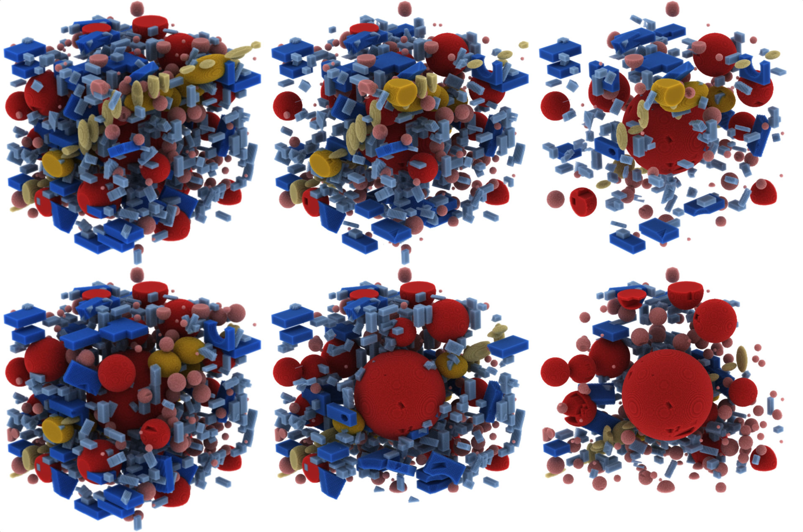

# [Volume Conductor](http://lgm.fri.uni-lj.si/portfolio-view/volume-conductor)



This is an implementation of the [Volume Conductor](http://lgm.fri.uni-lj.si/portfolio-view/volume-conductor)
on top of the [VPT framework](http://lgm.fri.uni-lj.si/portfolio-view/volumetric-path-tracing-framework).

## Building and running

You need `node` to build the framework and to run it.
You also need a browser that supports WebGL 2.0 Compute, such as Google Chrome Canary.
See the [instructions](https://github.com/9ballsyndrome/WebGL_Compute_shader) on how to set it up.

```bash
bin/packer
bin/server-node
```

A working build is available [here](http://lgm.fri.uni-lj.si/volume-conductor).

The three examples from the paper:
1. [Segmentation only](http://lgm.fri.uni-lj.si/vpt-conductor?ex=1)
2. [Colored groups](http://lgm.fri.uni-lj.si/vpt-conductor?ex=2)
3. [Sparsified groups](http://lgm.fri.uni-lj.si/vpt-conductor?ex=3)

## License

This project is licensed under the **GNU General Public License, version 3**.
See [LICENSE](LICENSE) for details.
